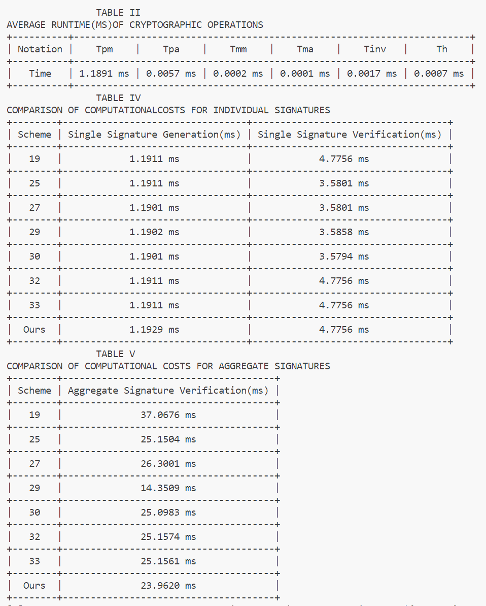

# Source Code of Efficient and Security-Enhanced Certificateless Aggregate Signature-Based Authentication Scheme with Conditional Privacy Preservation for VANETs
### These are Source Code of Efficient and Security-Enhanced Certificateless Aggregate Signature-Based Authentication Scheme with Conditional Privacy Preservation for VANETs, the aim of the experiment is to compare these objects' efficiency.
#### To run these codes, you should install PBC, openssl, firstly.

Result
 
